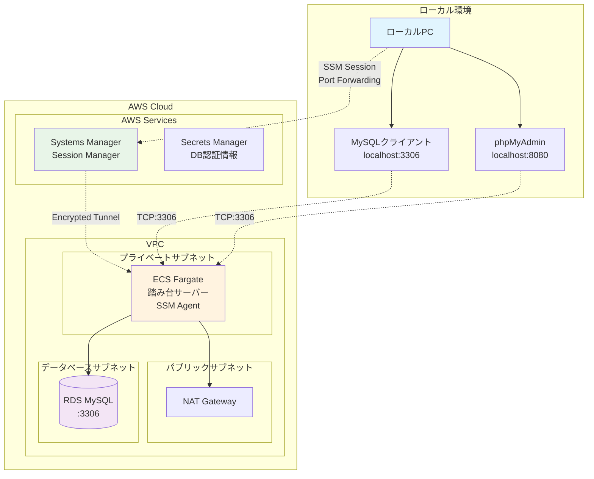
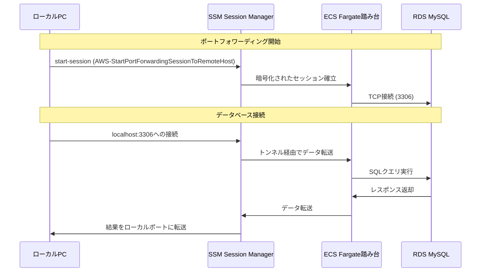
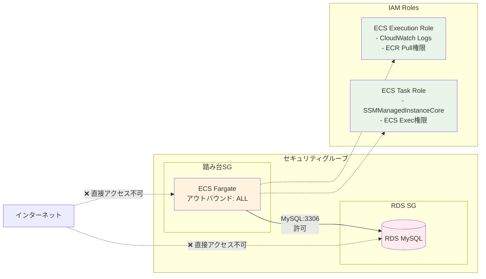

# ECS Fargate Bastion with SSM Port Forwarding

このプロジェクトは、ECS FargateタスクをSSM Session Managerのポートフォワーディング機能を使った踏み台として利用するためのCDK TypeScriptコードです。

## 概要

- ECS Fargateタスクを踏み台サーバーとして使用
- SSM Session Managerのリモートホストポートフォワーディング機能を活用
- VPC内のRDSなどのリソースに安全にアクセス可能
- インバウンドポートを開ける必要なし
- VPN不要でセキュアな接続
- サーバーレス（Fargate）による運用コスト削減
- IAMベースのアクセス制御
- セッション履歴の完全な監査ログ

### 従来の方法との比較

| 項目 | 従来のVPN | EC2踏み台 | **ECS Fargate踏み台** |
|------|-----------|-----------|----------------------|
| **セットアップ** | 複雑 | 中程度 | **シンプル** |
| **運用コスト** | 高い | 中程度 | **低い（サーバーレス）** |
| **セキュリティ** | 良い | 良い | **優秀（IAMベース）** |
| **スケーラビリティ** | 制限あり | 手動 | **自動** |
| **インバウンドポート** | 必要 | 必要 | **不要** |
| **監査ログ** | 限定的 | 限定的 | **完全** |
| **メンテナンス** | 必要 | 必要 | **最小限** |

## 前提条件

- AWS CLI v2がインストール済み
- Session Manager pluginがインストール済み
- 適切なAWS認証情報が設定済み
- Node.js 18以上

## セットアップ

1. 依存関係のインストール:

```bash
npm install
```

2. CDKのデプロイ:

```bash
npm run cdk bootstrap  # 初回のみ
npm run deploy
```

## 使用方法

### 方法1: シェルスクリプトを使用

```bash
./scripts/port-forward.sh -h <RDS_ENDPOINT> -r 3306 -l 3306
```

例:

```bash
./scripts/port-forward.sh -h ecsfargatebastionstack-sampledatabasea3a5194c-qngurnbimojv.c14ymig6qkjj.ap-northeast-1.rds.amazonaws.com -r 3306 -l 3306
```

### 方法2: TypeScriptヘルパーを使用

```bash
npx ts-node src/port-forward-helper.ts bastion-cluster bastion-service <RDS_ENDPOINT> 3306 3306
```

例:

```bash
npx ts-node src/port-forward-helper.ts bastion-cluster bastion-service ecsfargatebastionstack-sampledatabasea3a5194c-qngurnbimojv.c14ymig6qkjj.ap-northeast-1.rds.amazonaws.com 3306 3306
```

### 方法3: 手動でAWS CLIを使用

1. 実行中のタスクIDとランタイムIDを取得:

```bash
# タスクARNを取得
aws ecs list-tasks --cluster bastion-cluster --service-name bastion-service --desired-status RUNNING

# ランタイムIDを取得
aws ecs describe-tasks --cluster bastion-cluster --tasks <TASK_ARN> --query 'tasks[0].containers[0].runtimeId'
```

2. ポートフォワーディングを開始:

```bash
aws ssm start-session \
  --target ecs:bastion-cluster_<TASK_ID>_<RUNTIME_ID> \
  --document-name AWS-StartPortForwardingSessionToRemoteHost \
  --parameters '{"host":["<RDS_ENDPOINT>"],"portNumber":["3306"],"localPortNumber":["3306"]}'
```

## 接続確認

ポートフォワーディングが開始されたら、別のターミナルで以下のようにデータベースに接続できます:

### MySQLクライアントのインストール (macOS)

```bash
brew install mysql-client
```

### データベース接続

```bash
# TCP接続を明示的に指定（重要！）
mysql --protocol=TCP -h 127.0.0.1 -P 3306 -u admin -p

# または
mysql --protocol=TCP -h localhost -P 3306 -u admin -p
```

**注意**: `--protocol=TCP` オプションが必要です。これがないとMySQLクライアントはソケット接続を試行してエラーになります。

### 接続テスト例

```bash
# 1. バックグラウンドでポートフォワーディングを開始
./scripts/port-forward.sh -h <RDS_ENDPOINT> -r 3306 -l 3306 &

# 2. ポートが開いているか確認
nc -zv 127.0.0.1 3306

# 3. MySQLに接続
mysql --protocol=TCP -h 127.0.0.1 -P 3306 -u admin -p

# 4. 接続テスト
mysql --protocol=TCP -h 127.0.0.1 -P 3306 -u admin -p<PASSWORD> -e "SELECT 'Connection successful!' as status;"
```

### phpMyAdminを使用したWeb接続

DockerでphpMyAdminを起動してWebブラウザからMySQLに接続することも可能です：

```bash
# 1. ポートフォワーディングを開始（バックグラウンド）
./scripts/port-forward.sh -h <RDS_ENDPOINT> -r 3306 -l 3306 &

# 2. phpMyAdminをDockerで起動
docker run --name phpmyadmin -d \
  -e PMA_HOST=host.docker.internal \
  -e PMA_PORT=3306 \
  -p 8080:80 \
  phpmyadmin/phpmyadmin

# 3. ブラウザでアクセス
open http://localhost:8080
```

**接続情報:**

- URL: <http://localhost:8080>
- サーバー: `host.docker.internal` (自動設定済み)
- ユーザー名: `admin`
- パスワード: Secrets Managerから取得したパスワード

**停止方法:**

```bash
# phpMyAdminコンテナを停止・削除
docker stop phpmyadmin && docker rm phpmyadmin
```

### その他のDBクライアントツール

ポートフォワーディングが動作していれば、様々なDBクライアントツールが使用できます：

#### Adminer (軽量なWeb DB管理ツール)

```bash
docker run --name adminer -d -p 8081:8080 adminer
# ブラウザで http://localhost:8081 にアクセス
# サーバー: host.docker.internal:3306
```

#### MySQL Workbench

- ホスト: `127.0.0.1` または `localhost`
- ポート: `3306`
- ユーザー名: `admin`

#### DBeaver

- 接続タイプ: MySQL
- ホスト: `localhost`
- ポート: `3306`
- データベース: `sampledb`

#### Sequel Pro (macOS)

- ホスト: `127.0.0.1`
- ユーザー名: `admin`
- パスワード: Secrets Managerから取得
- ポート: `3306`

### パスワードの取得

RDSのパスワードはAWS Secrets Managerに保存されています:

```bash
# シークレット名を確認
aws secretsmanager list-secrets --query 'SecretList[].Name' --output table

# パスワードを取得
aws secretsmanager get-secret-value --secret-id <SECRET_NAME> --query SecretString --output text
```

## アーキテクチャ

### 全体構成図



### ネットワークフロー



### セキュリティ構成



## 主要コンポーネント

### インフラストラクチャ

- **VPC**: 3層構成（パブリック、プライベート、データベースサブネット）
- **ECS Cluster**: Fargateクラスター（サーバーレス）
- **ECS Service**: 踏み台用のFargateサービス（ECS Exec有効）
- **RDS**: MySQL 8.0インスタンス（t3.micro）
- **NAT Gateway**: プライベートサブネットのインターネットアクセス用

### セキュリティ

- **IAM Task Role**: SSM接続とECS Exec用権限
- **IAM Execution Role**: CloudWatch LogsとECR用権限
- **Security Groups**: 最小権限の原則に基づく設定
- **Secrets Manager**: データベース認証情報の安全な管理

### 監視・ログ

- **CloudWatch Logs**: ECSタスクのログ収集
- **SSM Session Manager**: セッション履歴とログ記録

## セキュリティ

- 踏み台サーバーはプライベートサブネットに配置
- RDSはデータベース専用サブネット（インターネットアクセスなし）
- セキュリティグループで踏み台からRDSへのアクセスのみ許可
- SSM Session Managerによる暗号化された接続

## 注意事項

- ECS FargateのSSMエージェントがリモートホストポートフォワーディングに対応したのは2022年11月から
- SSMエージェントのバージョンが3.1.1374.0以上である必要があります
- タスクが再起動されるとランタイムIDが変わるため、再度取得が必要
- Fargateコンテナではsystemdが使用できないため、SSMエージェントを直接起動しています
- MySQLクライアントでの接続時は必ず `--protocol=TCP` オプションを使用してください

## クリーンアップ

```bash
npm run destroy
```

## トラブルシューティング

### ポート接続の確認

```bash
# ポートが開いているか確認
netstat -an | grep 3306

# または
nc -zv 127.0.0.1 3306
```

### よくある問題

1. **"TargetNotConnected" エラー**
   - タスクがまだ起動中の可能性があります。少し待ってから再試行してください
   - タスクが停止している場合は、CloudWatch Logsでエラーを確認してください

2. **MySQL接続エラー**

   ```
   ERROR 2002 (HY000): Can't connect to local MySQL server through socket '/tmp/mysql.sock' (2)
   ```

   - `--protocol=TCP` オプションを使用してください
   - 正しいパスワードを使用しているか確認してください

3. **タスクが起動しない**
   - CloudWatch Logsでコンテナのログを確認してください:

   ```bash
   aws logs describe-log-streams --log-group-name /ecs/bastion-task --order-by LastEventTime --descending --max-items 1
   aws logs get-log-events --log-group-name /ecs/bastion-task --log-stream-name <LOG_STREAM_NAME>
   ```

   - タスク定義のリソース制限を確認してください

## 参考

- [元記事: ECS Fargateを踏み台にSSM Session Managerでポートフォワード](https://zenn.dev/quiver/articles/1458e453118254)
- [AWS SSM Session Manager](https://docs.aws.amazon.com/systems-manager/latest/userguide/session-manager.html)
- [ECS Exec](https://docs.aws.amazon.com/AmazonECS/latest/developerguide/ecs-exec.html)
